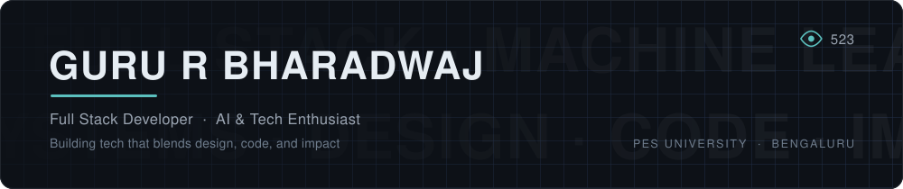

<picture>
  <source media="(prefers-color-scheme: dark)" srcset="assets/banner-dark.svg" />
  <source media="(prefers-color-scheme: light)" srcset="assets/banner-light.svg" />
  
</picture>

  
  &nbsp;
  &nbsp;
  &nbsp;

<h3 align="center">Tech Stack</h3>

<b>LANGUAGES</b>
 

  
<b>FRONTEND</b>
 

  
<b>BACKEND &amp; DATABASES</b>
 

  
<b>AI &nbsp;·&nbsp; ML &nbsp;·&nbsp; DATA</b>
 

  
<b>TOOLS &amp; PLATFORMS</b>
 

<!-- 
<h3 align="center">GitHub Stats</h3>

  

  

  

-->

  <picture>
    <source media="(prefers-color-scheme: dark)" srcset="https://raw.githubusercontent.com/guru-bharadwaj20/guru-bharadwaj20/output/snake-dark.svg" />
    <source media="(prefers-color-scheme: light)" srcset="https://raw.githubusercontent.com/guru-bharadwaj20/guru-bharadwaj20/output/snake-light.svg" />
    
  </picture>

<!-- Increments the view counter that .github/workflows/banner.yml reads and
     draws into the banner's top-right corner. Intentionally 1x1. -->

